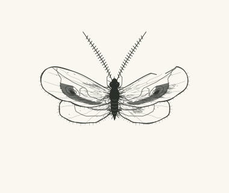
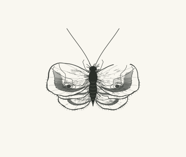
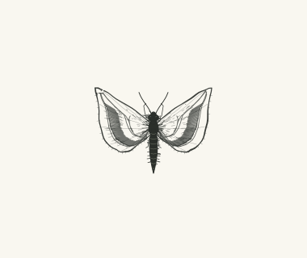
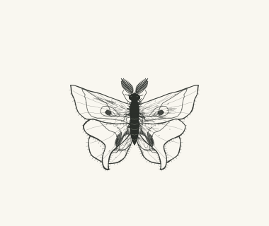
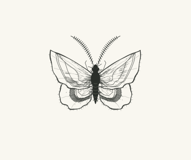
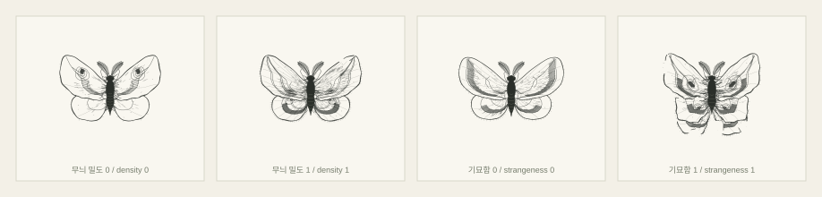

# Mothdraw

<p align="center">
  <b>English</b> · <a href="README.ko.md">한국어</a>
</p>

A browser tool that draws moths that never existed. One seed decides the shape, the markings and the wear, and the figure is drawn in front of you, outline first and texture last.

<p align="center">
  
</p>

<p align="center"><sub><code>nocturne-022</code></sub></p>

## Gallery

<table>
<tr>
<td align="center"></td>
<td align="center"></td>
<td align="center"></td>
<td align="center"></td>
<td align="center"></td>
</tr>
<tr>
<td align="center"><sub><code>nocturne-070</code></sub></td>
<td align="center"><sub><code>nocturne-064</code></sub></td>
<td align="center"><sub><code>nocturne-001</code></sub></td>
<td align="center"><sub><code>nocturne-045</code></sub></td>
<td align="center"><sub><code>nocturne-069</code></sub></td>
</tr>
</table>

Every specimen differs in overall size, wing pair count, antenna length and body proportion. The frame is fixed, so a small one looks small.

## Run

Node.js 22.12 or newer.

```sh
npm ci
npm run dev
```

## Controls

One specimen at a time. Set a seed and the three controls, press **그리기**, and the drawing plays.



| Control | What it does |
| --- | --- |
| **형태** — form | One of five families (rounded, pointed, swept, scalloped, tailed), or left to the seed |
| **무늬 밀도** — pattern density | How much wing venation, banding, shading, hatching, speckling and fringe |
| **기묘함** — strangeness | Line tremor, exaggerated proportions, eyespot size, body fur, torn margins, wing pair count. At zero nothing is torn and there are always two pairs |

Both sliders sit at the middle by default. Click the figure or press <kbd>Esc</kbd> to skip to the finished drawing; under `prefers-reduced-motion` it appears at once. The seed and the settings ride in the URL hash, so a link reproduces the same specimen, and **SVG 저장** writes a standalone file.
