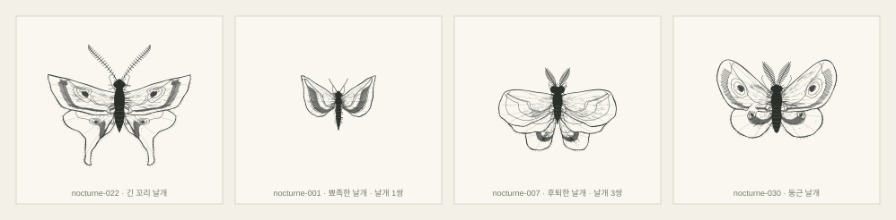

# Mothdraw

존재하지 않는 나방을 절차적으로 그리는 브라우저 도구. 시드 하나가 형태와 무늬와 마모를 전부 결정하고, 그려지는 과정이 그대로 재생됩니다.

<p align="center">
  
</p>

<p align="center"><sub><code>nocturne-022</code> · 윤곽 → 몸통 → 더듬이 → 날개맥 → 띠 → 눈알무늬 → 음영 → 해칭 → 가장자리 털</sub></p>

[fishdraw](https://github.com/LingDong-/fishdraw)의 규칙 기반 생성에서 출발했지만, 나방의 구조와 무늬는 독립적으로 설계했습니다. 면을 칠하지 않고 선으로만 그리며, 모든 선에 떨림이 들어가고 윤곽은 두 번 긋습니다. 생성형 AI, 서버, 데이터베이스를 쓰지 않습니다.

## 표본



개체마다 전체 크기, 날개 쌍 개수(1~3), 더듬이 길이, 머리·가슴·배의 비율이 다릅니다. 프레임은 고정이라 작은 개체는 작게 보입니다.

## 실행

Node.js 22.12 이상:

```sh
npm ci
npm run dev
```

이 Mac에는 시스템 npm이 없어 래퍼를 씁니다. Codex 런타임 경로는 이 기기 전용이며, 다른 환경에서는 Node.js와 npm을 설치하세요.

```sh
./scripts/npm.sh run dev
```

## 조작

화면에는 표본 한 마리만 둡니다. 시드와 세 가지 설정을 정하고 **그리기**를 누르면 그려지는 과정이 재생됩니다.


| 설정 | 하는 일 |
| --- | --- |
| **형태** | 다섯 계열(둥근·뾰족한·후퇴한·물결·긴 꼬리) 중 선택, 또는 시드에 맡김 |
| **무늬 밀도** | 날개맥, 띠, 음영, 해칭, 점, 가장자리 털의 양 |
| **기묘함** | 선 떨림, 비율 과장, 눈알무늬 크기, 몸통 털, 가장자리 손상, 날개 쌍 개수. 0이면 손상이 없고 날개는 항상 두 쌍 |

두 슬라이더의 가운데가 기준값입니다. 그리는 중에 화면을 누르거나 <kbd>Esc</kbd>를 누르면 바로 완성되고, `prefers-reduced-motion`이면 애니메이션 없이 완성본이 나옵니다. 시드와 설정은 URL 해시에 실려서 링크를 열면 같은 표본이 다시 나옵니다. **SVG 저장**은 자립형 파일을 내려받습니다.

## 엔진

```
시드 → 난수 스트림 → 형태 결정 → 윤곽 → 떨림 → 날개 내부 좌표계 → 무늬 → 마모 → 클리핑 → SVG
```

`structure`, `pattern`, `texture`, `ink` 네 개의 난수 스트림을 분리해, 질감을 고쳐도 실루엣이 바뀌지 않습니다. 같은 `seed` + `options` + `generatorVersion`은 같은 형상을 냅니다.

무늬는 날개마다 만드는 `(u, v)` 좌표계 위에 올립니다. `u`는 가장자리를 따라, `v`는 뿌리에서 가장자리까지입니다. 날개맥은 `u` 고정, 띠는 `v` 고정에 가깝게 그려 실루엣이 달라져도 흐름이 유지되고, 크기는 SVG 단위로 지정한 뒤 국소 축척으로 환산해 눈알무늬가 곡면을 따라 늘어납니다.

배치가 끝난 선은 폴리라인 클리핑으로 정리합니다. 날개는 뒤에서 앞으로 쌓인 쌍의 목록이고 각 쌍은 자기 앞의 모든 쌍에 가려지므로, 면을 칠하지 않아도 겹침이 올바르게 읽힙니다. 좌우는 오른쪽 좌표계에서 자른 뒤 미러링해 대칭이 정확하며, 마모와 질감만 좌우를 따로 뽑습니다.

| 디렉토리 | 내용 |
| --- | --- |
| `src/core/` | 시드 난수, 기하 연산, 폴리라인 클리핑, 선 떨림 |
| `src/generator/` | 형태 결정, 몸통과 다리, 날개, 날개 내부 좌표계, 무늬, 질감과 마모 |
| `src/render/` | SVG 변환, 레이어 계획 |
| `src/ui/` | 입력, URL 상태, 그리기 애니메이션 |

자세한 설계 규칙은 [개발 가이드라인](./DEVELOPMENT.md)에 있습니다.

## 검증

```sh
./scripts/npm.sh run check
./scripts/npm.sh test
./scripts/npm.sh run build
```

고정 20개, 추가 200개, 다이얼 양 끝 72개 시드에 대해 결정성, 좌표 범위, 닫힌 윤곽, 날개 자체 교차, 뿌리 연결, 좌우 대칭, 선 개수 상한을 검사합니다. 무늬는 소속 날개 안에 있는지와 앞쪽 날개를 관통하지 않는지를, 옵션은 정규화와 재현성을, 애니메이션은 가짜 DOM 위에서 모든 선이 정확히 한 번씩 손 순서대로 그려지는지를 확인합니다.

## 도판

여러 마리를 한눈에 비교할 때 씁니다. 서버 없이 브라우저로 바로 열립니다.

```sh
./scripts/npm.sh run plate -- ./artifacts
```

무늬 20개, 실루엣 20개, 구조 20개, 조사용 100개 네 장을 만듭니다. 실루엣과 구조 보기는 마모 전의 생성 형태를 보여줍니다. README의 샘플 이미지는 `./scripts/npm.sh run docs`로 다시 만듭니다.

## 범위

수집 기능과 표본함은 만들지 않습니다. 표본을 남기는 수단은 URL과 SVG 저장입니다. 실제 종을 재현하거나 생물학적 정확성을 보장하지 않습니다.

## 생성기 변경 기록

| 버전 | 내용 |
| --- | --- |
| **0.6.0** | 전체 크기, 날개 쌍 개수(1~3), 더듬이 길이, 머리·가슴·배 비율에 변주. 프레임 380×320으로 확대 |
| **0.5.0** | `generateMoth(seed, options)`로 형태·무늬 밀도·기묘함을 받음. 화면을 도감에서 단일 표본과 그리기 애니메이션으로 교체 |
| **0.4.0** | 면 채움 제거, 선 떨림과 이중 윤곽, 겹눈·다리·털, 짙은 음영 덩어리, 좌우 비대칭 손상 |
| **0.3.0** | 날개맥, 띠, 눈알무늬, 해칭, 점, 가장자리 털. 날개 내부 좌표계와 클리핑 |
| **0.2.0** | 시드 기반 실루엣, 다섯 형태 계열 |

성능은 표본 한 마리 생성 3.7ms, 표본당 선 약 751개입니다 (Node.js v24.19.0, Apple Silicon). 목표인 200ms 안입니다.
